# Practica07-Apartamento-VR
## OBJETIVO

- Experimenta con aplicaciones de realidad virtual.
- Experimenta con aplicaciones de realidad aumentada.
- Distingue la diferencia entre tecnologías de realidad virtual y realidad aumentada.

## ACTIVIDADES DESARROLLADAS

El Apartamento debe tener al menos 25 modelos prefabs (objetos 3D) que deben ser colocados apropiadamente dentro de la escena. Los objetos no pueden estar flotando sin motivos reales.

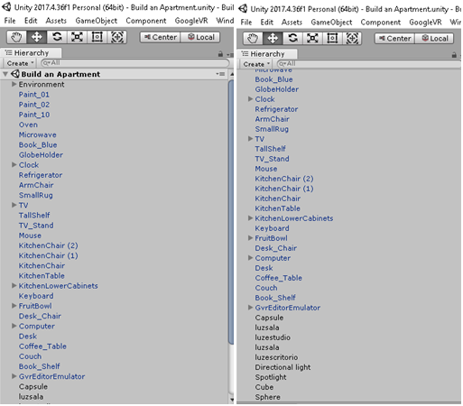

***

Crear al menos un material para cambiar el color de uno o varios objetos de la escena.
Crear al menos un shader que cambie el color de un objeto con base al tiempo transcurrido desde la ejecución de la app.

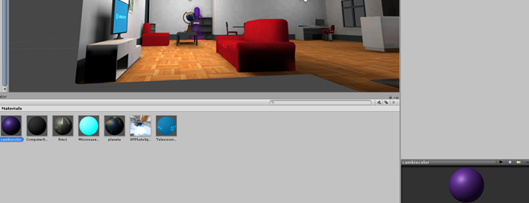

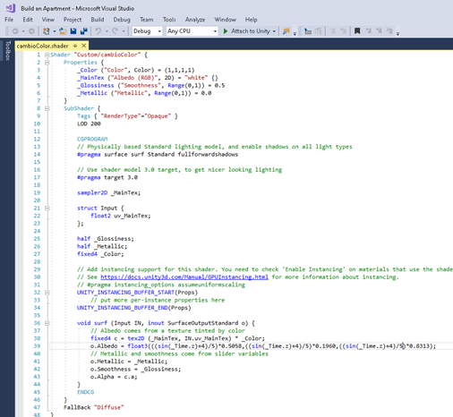

***

Crear un tablero de ajedrez y colocarlo sobre un objeto (por ejemplo: mesa, estante, etc) usando materiales y texturas.

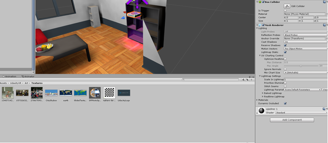

***

Crear al menos tres cuadros o portarretratos con imágenes del estudiante y su familia.

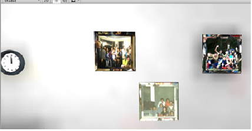

***

Crear un globo terráqueo usando una textura con base a una imagen del mapa del mundo

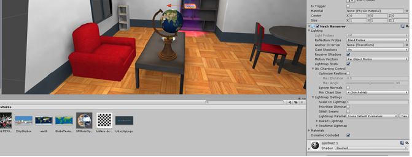

***

Animar las manecillas del reloj.
Añadir luces a la escena

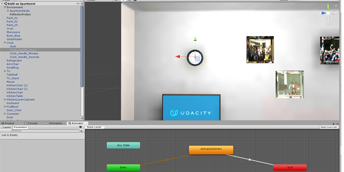

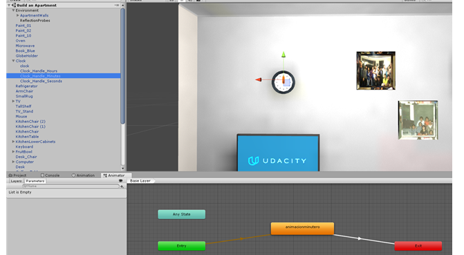

Crear un trigger que permita cambiar el sentido de una de las manecillas del reloj.

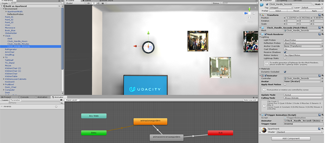

***

Animar el globo terráqueo para que gire horizontalmente.

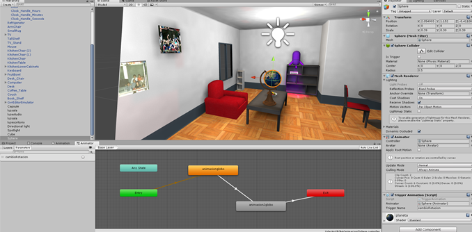

Crear un trigger que permita girar y detener la animación del globo terráqueo

***

Añadir una cámara de realidad virtual (GoogleVR) y colocarla para que la aplicación inicie dentro de la escena del apartamento.

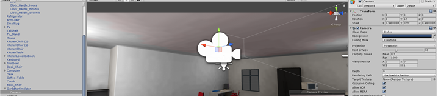

***

Actualizar las configuración del jugador (Nombre de la compañía, nombre del producto, paquete, soporte para VR, etc)

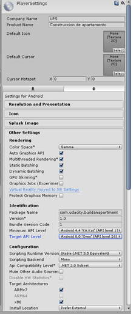

***

## Conclusiones

Conclusiones:
La aplicacion de la realidad virtual es un ámbito extenso y profundo. El desarrollo de un entrono que se adecue a las expectativas y que no conflictue con el usuario, es un proceso en el cual se deben tomar en cuenta varios conceptos como:
- Iluminacion
- Percepción de ambiente
-	Tecnología implicada para el uso de esta.
-	Animación
-	Planos
-	Excenas
-	Entre otros.
Para esto se requiere un conocimiento básico, pero para generar un producto para la industria, se debe tener en cuenta cada una de las temáticas con conocimiento profundo o experimentado.

